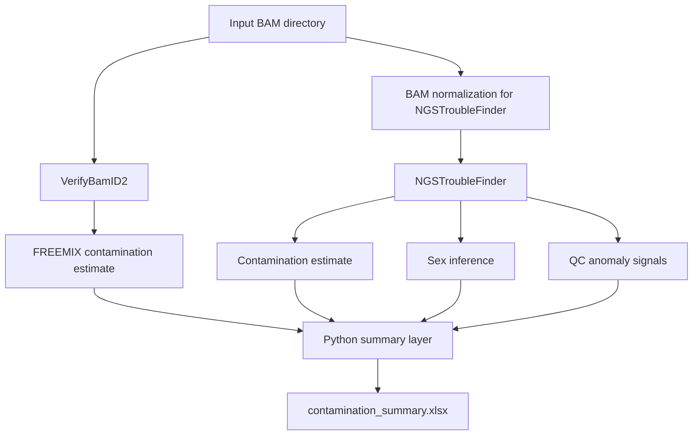

# Contamination QC Pipeline

NGS contamination quality control pipeline integrating VerifyBamID2 and NGSTroubleFinder to assess contamination, sex consistency and general sample quality signals from aligned sequencing data.

This repository provides a lightweight and reproducible workflow for contamination screening in BAM files generated from exome or targeted sequencing experiments. The pipeline combines two complementary approaches: population SNP-based contamination estimation with VerifyBamID2 and pileup-based QC analysis with NGSTroubleFinder. Final outputs are consolidated into a single Excel summary report for rapid review in routine sequencing QC workflows.

The workflow was designed to support automated contamination triage before downstream variant analysis.

Contamination detection using a single algorithm can sometimes lead to ambiguous interpretation. Some samples show borderline signals that are difficult to interpret using only one method. This workflow improves reliability by combining two orthogonal QC approaches. VerifyBamID2 estimates contamination using population SNP allele frequencies and produces the FREEMIX contamination metric. NGSTroubleFinder performs pileup-based QC analysis and provides contamination estimates, sex inference and sample-level anomaly signals. A lightweight Python aggregation layer merges results from both tools and produces a compact Excel report for analyst review.

---

# Pipeline workflow



---

# Repository structure

```
contamination-qc-pipeline/
├── run_qc.sh
├── README.md
├── qc_env.yml
├── .gitignore
├── scripts/
│   └── fix_chr_prefix.sh
└── examples/
    └── demo_contamination_summary.xlsx
```

---

# Installation

Clone the repository

```bash
git clone https://github.com/caganyasa/contamination-qc-pipeline.git
cd contamination-qc-pipeline
```

Create the conda environment

```bash
conda env create -f qc_env.yml
conda activate qc_env
```

Install NGSTroubleFinder

```bash
git clone https://github.com/BCM-HGSC/NGS-Trouble-Finder.git
cd NGS-Trouble-Finder
pip install .
cd ..
```

---

# Running the pipeline

Execute the main script

```bash
bash run_qc.sh
```

The script will prompt for the directory containing BAM files. All BAM files inside the directory will be processed automatically.

Example input directory

```
/data/bams/
    sample1.bam
    sample1.bam.bai
    sample2.bam
    sample2.bam.bai
    sample3.bam
    sample3.bam.bai
```

---

# Output structure

After execution results will be written to the directory `qc_results`

```
qc_results/
├── verifybamid/
│   └── *.selfSM
├── ngstf/
│   ├── qcReport.tsv
│   └── report.html
└── contamination_summary.xlsx
```

The final Excel report contains four columns:

- Sample  
- VerifyBamID2  
- NGSTF  
- Sex  

Rows exceeding contamination thresholds are automatically highlighted.

---

# Default thresholds

VerifyBamID2 contamination threshold

```
FREEMIX ≥ 0.02
```

NGSTroubleFinder contamination threshold

```
contamination ≥ 0.05
```

These thresholds can be modified depending on sequencing platform, capture kit or laboratory QC policy.

---

# Reference resources

VerifyBamID2 requires a reference genome and a SNP panel.

Example reference genome files

```
hg38.fa
hg38.fa.fai
```

Example SNP panel

```
1000g.phase3.10k.b38.exome.vcf.gz.dat
```

These reference resources are not included in the repository and must be prepared separately.

---

# Example output

An anonymized demonstration report is provided in the repository

```
examples/demo_contamination_summary.xlsx
```

The example file preserves report structure and contamination score distributions while removing real sample identifiers.

---

# Supporting scripts

The `scripts/` directory contains helper utilities used by the pipeline.  
For example `fix_chr_prefix.sh` is used to normalize chromosome naming conventions in BAM headers to ensure compatibility between BAM files and downstream QC tools.

---

# Tools and credits

This pipeline integrates the following open source tools.

VerifyBamID2  
https://github.com/Griffan/VerifyBamID

VerifyBamID2 is used for population SNP-based contamination estimation and the pipeline extracts the FREEMIX metric from selfSM output files.

NGSTroubleFinder  
https://github.com/BCM-HGSC/NGS-Trouble-Finder

NGSTroubleFinder is used for pileup-based QC analysis including contamination detection, sex inference and anomaly signals.

If you use this workflow in research or production environments please cite the original tools accordingly.

---

# Limitations

Large reference resources such as genome FASTA files and SNP panels are not distributed with this repository. Thresholds implemented in the current workflow are intended for practical QC screening and may require adjustment depending on sequencing assay design and laboratory validation criteria.

---

# Data privacy

This repository does not contain real sequencing data or patient identifiers. BAM files, FASTQ files, reference genomes and internal QC outputs are intentionally excluded. The repository demonstrates only the pipeline logic and output structure.

---

# Author

Çağan Yasa  
Bioinformatics Specialist

This pipeline was developed as part of routine NGS contamination quality control workflows used in sequencing environments.
